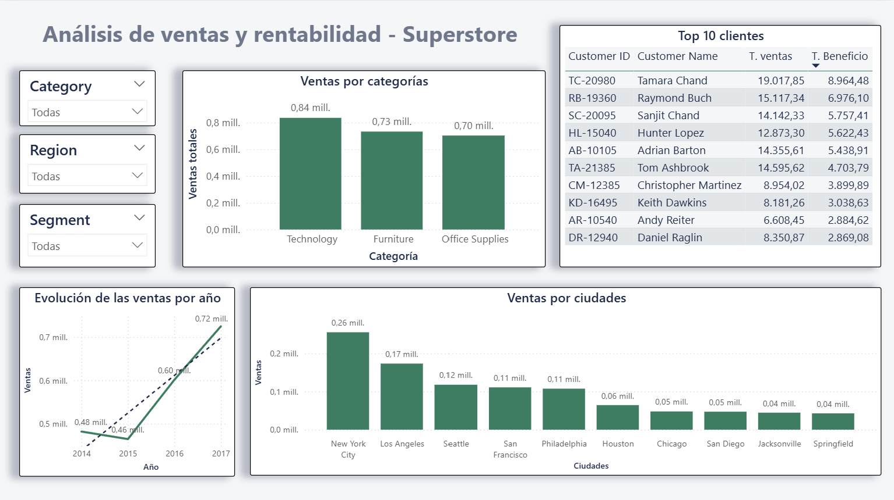
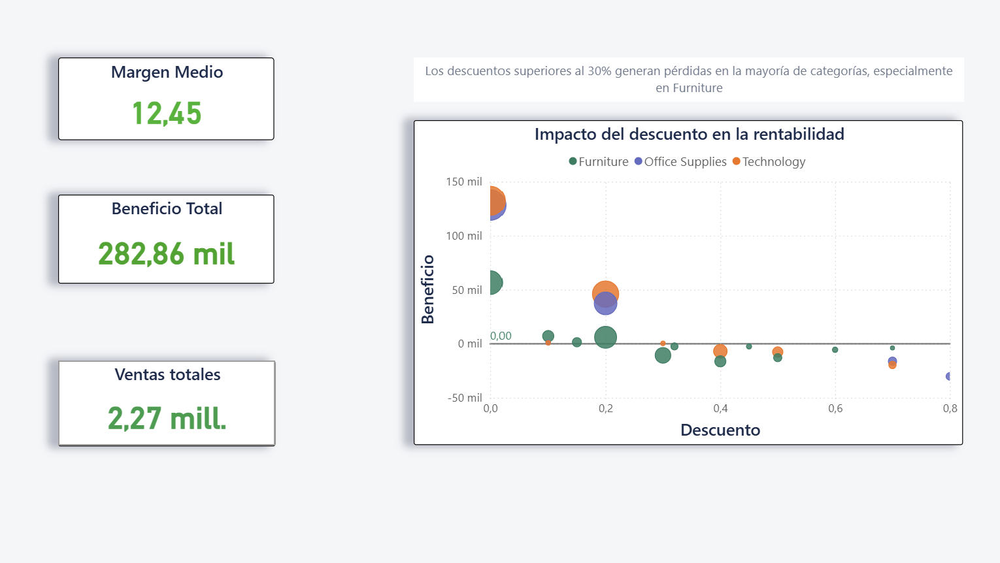

# 📊 Superstore Sales Analysis (SQL + Power BI)

This project analyzes sales, profitability, and discount impact using the Superstore dataset.

## 🔍 Objectives
- Identify the most profitable categories and products
- Analyze top-performing customers and cities
- Evaluate sales trends over time
- Assess the impact of discounts on profitability

## 🛠 Tools Used
- MySQL (data exploration & validation)
- Power BI (data modeling & visualization)
- DAX (measures and KPIs)

## 📈 Key Insights
- Technology is the top-performing category in terms of sales
- Discounts above 30% lead to negative profitability, especially in Furniture
- New York City generates the highest sales
- A small group of customers contributes significantly to total revenue

## 📊 Dashboard Features
- Interactive filters (Category, Region, Segment)
- KPI cards (Total Sales, Profit, Margin)
- Sales trends over time
- Top 10 customers analysis
- Discount vs Profit scatter analysis

## 📁 Files
- `superstore.pbix` → Power BI dashboard
- `superstore.pdf` → Dashboard preview

## 📊 Dashboard Overview

## 📉 Discount Analysis

---

💡 This project demonstrates end-to-end data analysis: from SQL exploration to business insights in Power BI.
